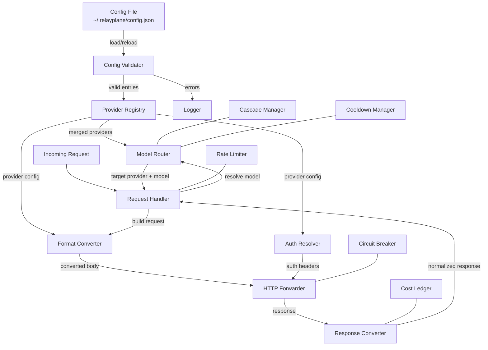

# Design Document: Configurable Providers

## Overview

This feature introduces a dynamic Provider Registry that loads custom LLM provider definitions from `~/.relayplane/config.json` at startup, enabling users to add OpenAI-compatible or Anthropic-compatible providers without modifying source code.

Currently, providers are hardcoded in `DEFAULT_ENDPOINTS` and `MODEL_MAPPING` within `standalone-proxy.ts`. This design extends the proxy with a registry layer that merges built-in providers with user-defined custom providers, handling configuration validation, format conversion, authentication, and hot-reload.

### Design Goals

- Zero code changes required to add a new provider
- Full feature parity with built-in providers (circuit breaker, cascade, cost tracking, rate limiting)
- Automatic request/response format conversion between OpenAI and Anthropic APIs
- Graceful hot-reload without dropping in-flight requests
- Clear validation errors at startup to catch misconfigurations early

## Architecture



### Key Architectural Decisions

1. **Registry as a merge layer**: The Provider Registry merges `DEFAULT_ENDPOINTS` + `MODEL_MAPPING` with custom providers at load time, producing a unified lookup table. Custom providers override built-in ones by name.

2. **Format conversion is bidirectional**: The proxy already converts OpenAI→Anthropic (for routing to Claude) and Anthropic→OpenAI (for response normalization). We reuse these existing converters for custom providers based on their `apiCompatibility` field.

3. **Hot-reload via admin endpoint**: A `POST /v1/admin/reload-providers` endpoint triggers re-reading the config file and diffing the provider list. Active connections are preserved through reference counting.

4. **Validation at load time**: All provider configs are validated before being registered. Invalid entries are skipped with clear error messages, never silently accepted.

## Components and Interfaces

### 1. ProviderRegistry (`src/provider-registry.ts`)

Central registry that manages all providers (built-in + custom).

```typescript
export interface CustomProviderConfig {
  /** Unique identifier for the provider */
  name: string;
  /** Base URL for API requests (e.g., "https://api.example.com/v1") */
  baseUrl: string;
  /** API compatibility type */
  apiCompatibility: 'openai' | 'anthropic';
  /** Environment variable name containing the API key */
  apiKeyEnvVar: string;
  /** Direct API key value (takes priority over env var) */
  apiKeyValue?: string;
  /** Custom headers to include in every request */
  headers?: Record<string, string>;
  /** Custom auth header name (overrides default for the compatibility type) */
  authHeader?: string;
  /** Model definitions */
  models?: Array<string | { name: string; remoteModel: string }>;
  /** Prefix-based routing: all models starting with this prefix route here */
  modelPrefix?: string;
  /** Cost per 1K input tokens (USD) */
  costPer1kInput?: number;
  /** Cost per 1K output tokens (USD) */
  costPer1kOutput?: number;
}

export interface ResolvedProvider {
  name: string;
  baseUrl: string;
  apiCompatibility: 'openai' | 'anthropic';
  apiKey: string | null;
  headers: Record<string, string>;
  authHeader: string;
  costPer1kInput: number;
  costPer1kOutput: number;
  isCustom: boolean;
}

export interface ModelRoute {
  provider: string;
  remoteModel: string;
}

export interface ReloadResult {
  added: string[];
  removed: string[];
  unchanged: string[];
  errors: string[];
}

export class ProviderRegistry {
  private providers: Map<string, ResolvedProvider>;
  private modelRoutes: Map<string, ModelRoute>;
  private prefixRoutes: Array<{ prefix: string; provider: string }>;
  private inFlightCount: Map<string, number>;

  constructor();

  /** Load custom providers from config, merge with built-ins */
  load(customProviders: CustomProviderConfig[]): ReloadResult;

  /** Reload from config file, computing diff */
  reload(): ReloadResult;

  /** Resolve a model name to its target provider and remote model */
  resolveModel(modelName: string): ModelRoute | null;

  /** Get the resolved provider config by name */
  getProvider(name: string): ResolvedProvider | null;

  /** Get all registered provider names */
  getProviderNames(): string[];

  /** Get all registered model names */
  getModelNames(): string[];

  /** Track in-flight request start */
  trackRequestStart(provider: string): void;

  /** Track in-flight request end */
  trackRequestEnd(provider: string): void;

  /** Check if provider has in-flight requests */
  hasInFlightRequests(provider: string): boolean;
}
```

### 2. ConfigValidator (`src/config-validator.ts`)

Validates custom provider configurations at load time.

```typescript
export interface ValidationResult {
  valid: CustomProviderConfig[];
  errors: Array<{ provider: string; field: string; message: string }>;
  warnings: Array<{ provider: string; message: string }>;
}

export function validateCustomProviders(
  configs: unknown[],
  builtInNames: string[]
): ValidationResult;
```

**Validation rules:**
- `name`: required, non-empty string
- `baseUrl`: required, valid URL (must parse with `new URL()`)
- `apiCompatibility`: required, must be `'openai'` or `'anthropic'`
- `apiKeyEnvVar`: required, non-empty string
- Name conflicts with built-in: warning (custom overrides)
- Missing API key (env var not set, no `apiKeyValue`): warning

### 3. FormatConverter (`src/format-converter.ts`)

Handles bidirectional conversion between OpenAI and Anthropic request/response formats. Wraps existing conversion functions from `standalone-proxy.ts` into a reusable module.

```typescript
export type ApiFormat = 'openai' | 'anthropic';

export interface ConversionContext {
  sourceFormat: ApiFormat;
  targetFormat: ApiFormat;
  targetModel: string;
  stream: boolean;
}

/** Convert request body between formats */
export function convertRequestBody(
  body: Record<string, unknown>,
  context: ConversionContext
): Record<string, unknown>;

/** Convert non-streaming response between formats */
export function convertResponseBody(
  body: Record<string, unknown>,
  context: ConversionContext
): Record<string, unknown>;

/** Convert a single SSE chunk between formats */
export function convertStreamChunk(
  chunk: string,
  context: ConversionContext,
  state: StreamConversionState
): string | null;

/** Detect the format of an incoming request based on the endpoint path */
export function detectRequestFormat(path: string): ApiFormat;
```

### 4. AuthResolver (`src/auth-resolver.ts`)

Resolves the correct authentication headers for a provider.

```typescript
export interface AuthHeaders {
  [headerName: string]: string;
}

/** Build auth headers for a resolved provider */
export function buildAuthHeaders(provider: ResolvedProvider): AuthHeaders;
```

**Logic:**
- If `provider.authHeader` is set → use that header name with the API key
- If `apiCompatibility === 'openai'` → `Authorization: Bearer <key>`
- If `apiCompatibility === 'anthropic'` → `x-api-key: <key>`
- Merge with `provider.headers` (custom headers)

### 5. Admin Reload Endpoint

Added to the existing request handler in `standalone-proxy.ts`:

```typescript
// POST /v1/admin/reload-providers
// Response: { added: string[], removed: string[], unchanged: string[], errors: string[] }
```

## Data Models

### Configuration Schema (`~/.relayplane/config.json`)

```json
{
  "customProviders": [
    {
      "name": "azure-openai",
      "baseUrl": "https://my-resource.openai.azure.com/openai/deployments/gpt-4",
      "apiCompatibility": "openai",
      "apiKeyEnvVar": "AZURE_OPENAI_KEY",
      "headers": {
        "api-version": "2024-02-01"
      },
      "models": [
        "azure-gpt4",
        { "name": "azure-gpt4-turbo", "remoteModel": "gpt-4-turbo" }
      ],
      "costPer1kInput": 0.01,
      "costPer1kOutput": 0.03
    },
    {
      "name": "custom-claude",
      "baseUrl": "https://my-anthropic-proxy.internal/v1",
      "apiCompatibility": "anthropic",
      "apiKeyEnvVar": "CUSTOM_CLAUDE_KEY",
      "apiKeyValue": "sk-direct-key-here",
      "authHeader": "X-Custom-Auth",
      "models": ["internal-claude"],
      "modelPrefix": "internal/"
    }
  ]
}
```

### Internal Data Structures

```typescript
/** Stored in ProviderRegistry.providers Map */
interface ResolvedProvider {
  name: string;
  baseUrl: string;
  apiCompatibility: 'openai' | 'anthropic';
  apiKey: string | null;        // resolved from apiKeyValue or env var
  headers: Record<string, string>;
  authHeader: string;           // resolved header name
  costPer1kInput: number;       // default: 0
  costPer1kOutput: number;      // default: 0
  isCustom: boolean;            // true for user-defined providers
}

/** Stored in ProviderRegistry.modelRoutes Map */
interface ModelRoute {
  provider: string;             // provider name
  remoteModel: string;          // model name to send upstream
}

/** Prefix route entry (checked in order) */
interface PrefixRoute {
  prefix: string;
  provider: string;
}
```

### Integration Points with Existing Systems

| System | Integration Method |
|--------|-------------------|
| Circuit Breaker | One `CircuitBreaker` instance per custom provider, keyed by name |
| Cooldown Manager | Custom providers added to the existing `CooldownManager` health map |
| Cross-Provider Cascade | Custom provider names valid in `crossProviderCascade.providers` array |
| Cost Ledger | `CostRecord` uses custom provider name + model; custom rates used for estimation |
| Rate Limiter | Custom provider names valid in `rateLimit.models` and `providers` config |
| Agent Tracker | Provider name included in `trackAgent()` calls |
| Routing Log | Provider name + model logged via `appendRoutingLog()` |
| Telemetry | Provider name included in cloud telemetry events |

## Correctness Properties

*A property is a characteristic or behavior that should hold true across all valid executions of a system—essentially, a formal statement about what the system should do. Properties serve as the bridge between human-readable specifications and machine-verifiable correctness guarantees.*

### Property 1: Provider loading completeness

*For any* valid array of custom provider configurations, after loading into the Provider Registry, every provider in the array SHALL be retrievable by its `name` field.

**Validates: Requirements 1.1**

### Property 2: Validation rejects invalid configurations

*For any* provider configuration object that is missing one or more required fields (`name`, `baseUrl`, `apiCompatibility`, `apiKeyEnvVar`) OR has an `apiCompatibility` value other than `'openai'`/`'anthropic'` OR has a `baseUrl` that is not a valid URL, the Config Validator SHALL exclude it from the valid results and include a corresponding error entry.

**Validates: Requirements 1.2, 4.2, 4.3, 4.4**

### Property 3: API key resolution priority

*For any* custom provider with both `apiKeyEnvVar` and `apiKeyValue` defined, the resolved API key SHALL equal `apiKeyValue` regardless of the environment variable's value.

**Validates: Requirements 1.3**

### Property 4: Custom headers inclusion

*For any* custom provider with a `headers` map containing N entries, every outgoing request to that provider SHALL include all N custom headers with their specified values.

**Validates: Requirements 1.4**

### Property 5: Custom provider overrides built-in

*For any* custom provider whose `name` matches a built-in provider name, the Provider Registry SHALL return the custom provider's configuration (baseUrl, apiCompatibility) when queried by that name.

**Validates: Requirements 1.5**

### Property 6: Model entry resolution

*For any* custom provider with a `models` array, if an entry is a string `s`, then resolving model `s` SHALL return `{ provider: providerName, remoteModel: s }`. If an entry is `{ name: n, remoteModel: r }`, then resolving model `n` SHALL return `{ provider: providerName, remoteModel: r }`.

**Validates: Requirements 2.1, 2.2, 2.3**

### Property 7: Custom model overrides built-in mapping

*For any* model name that exists in both `MODEL_MAPPING` and a custom provider's `models` array, resolving that model SHALL return the custom provider as the target, not the built-in mapping.

**Validates: Requirements 2.4**

### Property 8: Prefix-based routing

*For any* custom provider with `modelPrefix` set to prefix `P`, and *for any* model name that starts with `P`, the Provider Registry SHALL route that model to the custom provider. Model names that do NOT start with `P` SHALL NOT be routed to that provider by prefix alone.

**Validates: Requirements 2.5**

### Property 9: Format passthrough when compatible

*For any* valid request body in format F (OpenAI or Anthropic) targeting a custom provider with `apiCompatibility` equal to F, the forwarded request body SHALL be structurally identical to the input body (no format conversion applied).

**Validates: Requirements 3.1, 3.2**

### Property 10: OpenAI-to-Anthropic conversion produces valid structure

*For any* valid OpenAI chat completion request body, converting it to Anthropic format SHALL produce an object containing: a `messages` array (with no system-role entries), a `model` field, a `max_tokens` field, and if the original had a system message, a top-level `system` field.

**Validates: Requirements 3.3**

### Property 11: Anthropic-to-OpenAI conversion produces valid structure

*For any* valid Anthropic messages request body, converting it to OpenAI format SHALL produce an object containing: a `messages` array where system content appears as a message with `role: "system"`, and a `model` field.

**Validates: Requirements 3.4**

### Property 12: Auth header matches provider configuration

*For any* resolved provider, the outgoing auth header SHALL be: the `authHeader` field value if defined, otherwise `"Authorization"` if `apiCompatibility === 'openai'`, otherwise `"x-api-key"` if `apiCompatibility === 'anthropic'`.

**Validates: Requirements 3.5, 3.6, 3.7**

### Property 13: Cost calculation with custom rates

*For any* custom provider with `costPer1kInput = ci` and `costPer1kOutput = co`, and *for any* request with `inputTokens` and `outputTokens`, the estimated cost SHALL equal `(inputTokens / 1000) * ci + (outputTokens / 1000) * co`.

**Validates: Requirements 5.3**

### Property 14: Reload diff correctness

*For any* two provider configuration states (before and after), the reload response SHALL list: in `added` all provider names present in after but not before, in `removed` all names present in before but not after, and in `unchanged` all names present in both.

**Validates: Requirements 8.1, 8.4**

## Error Handling

### Configuration Errors (Startup)

| Error Condition | Behavior |
|----------------|----------|
| `customProviders` is not an array | Log error, skip entire section, continue with built-in providers only |
| Entry missing required field | Log error with field name, skip entry, continue with remaining entries |
| Invalid `apiCompatibility` value | Log error, skip entry |
| Invalid `baseUrl` | Log error, skip entry |
| API key env var not set (no `apiKeyValue`) | Log warning, register provider (will fail at request time) |
| Duplicate `name` in custom providers | Log warning, last entry wins |
| Config file unreadable/malformed JSON | Log error, continue with built-in providers only |

### Runtime Errors

| Error Condition | Behavior |
|----------------|----------|
| Custom provider returns 5xx | Circuit breaker records failure; cascade to next provider if configured |
| Custom provider unreachable | Circuit breaker trips; cooldown applied |
| API key missing at request time | Return 401 with clear error message identifying the provider |
| Format conversion fails | Return 500 with error details; log the conversion failure |
| Reload endpoint called with invalid config | Return 400 with validation errors; preserve current state |
| In-flight request to removed provider | Allow completion; do not interrupt |

### Error Response Format

```json
{
  "error": {
    "type": "provider_configuration_error",
    "message": "Custom provider 'my-provider' has no API key configured. Set the MY_PROVIDER_KEY environment variable or add apiKeyValue to the provider config.",
    "provider": "my-provider"
  }
}
```

## Testing Strategy

### Property-Based Tests (using `fast-check` with Vitest)

Property-based testing is appropriate for this feature because:
- The Provider Registry has pure functions with clear input/output behavior (validation, resolution, conversion)
- Universal properties hold across a wide input space (any valid config, any model name, any request body)
- The format conversion logic is a data transformation with round-trip properties

**Configuration:**
- Minimum 100 iterations per property test
- Each test tagged with: `Feature: configurable-providers, Property {N}: {title}`
- Library: `fast-check` (standard PBT library for TypeScript/Vitest)

**Property tests to implement:**
1. Provider loading completeness (Property 1)
2. Validation rejects invalid configs (Property 2)
3. API key resolution priority (Property 3)
4. Custom headers inclusion (Property 4)
5. Custom provider overrides built-in (Property 5)
6. Model entry resolution (Property 6)
7. Custom model overrides built-in (Property 7)
8. Prefix-based routing (Property 8)
9. Format passthrough (Property 9)
10. OpenAI→Anthropic conversion structure (Property 10)
11. Anthropic→OpenAI conversion structure (Property 11)
12. Auth header resolution (Property 12)
13. Cost calculation (Property 13)
14. Reload diff correctness (Property 14)

### Unit Tests (Example-Based)

- Startup logging: verify provider count is logged (Req 4.6)
- Warning for missing API key env var (Req 4.5)
- Verbose mode logs provider list (Req 7.3)
- `relayplane init` includes commented example (Req 7.2)
- Streaming passthrough for OpenAI-compatible providers (Req 6.1)
- Streaming passthrough for Anthropic-compatible providers (Req 6.2)
- Per-chunk conversion in cross-format streaming (Req 6.3)

### Integration Tests

- Circuit breaker trips after consecutive failures to custom provider (Req 5.1)
- Cross-provider cascade includes custom providers (Req 5.4)
- Rate limiting applied to custom providers (Req 5.5)
- Cooldown applied after failures (Req 5.6)
- Telemetry records include custom provider name (Req 5.7)
- Hot-reload preserves in-flight requests (Req 8.2)
- Removed provider allows in-flight completion (Req 8.3)
